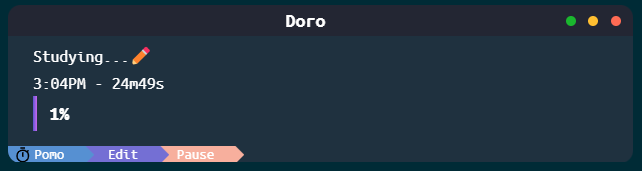

# Doro App

The Doro app is an Electron-based timer application designed for managing Pomodoro sessions along with short and long breaks.

## Features

- **Pomodoro Timer**: Helps you focus on tasks by using the Pomodoro Technique, consisting of work sessions followed by short breaks.
- **Short Break and Long Break**: Offers short breaks after each Pomodoro session and longer breaks after a certain number of completed Pomodoros.
- **User Interface**:
  - Displays the current timer mode (Pomodoro, Short Break, or Long Break).
  - Allows starting, pausing, and continuing the timer.
  - Editable mode for setting custom session names.
  - Dynamic width gradient display indicating timer progress.
  - Title bar buttons for minimizing, maximizing, and closing the app.

## Getting Started
Installer will be published shortly, for now the only way is to run it locally with npm.

To run the application locally, follow these steps:

1. **Clone the repository**:

    ```
    git clone https://github.com/your-username/doro-app.git
    ```

2. **Install dependencies**:

    ```
    cd doro-app
    npm install
    ```

3. **Run the app**:

    ```
    npm start
    ```

## Usage

### Timer Controls

- **Start/Pause/Continue**: Click the button to start the timer. While running, click again to pause, and click once more to continue.
- **State Change**: Click on the mode (Pomodoro, Short Break, Long Break) to switch between different modes.

### Editable Mode

- Click the "Edit" button to enable editing of the session name.
- Press "Enter" to save the edited name.

## Development

The app's source code is written in JavaScript using Electron. It uses various event listeners to handle timer functionality, mode changes, and user interactions.

 